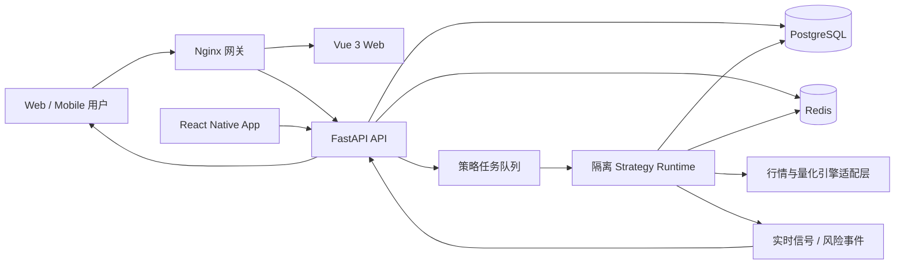
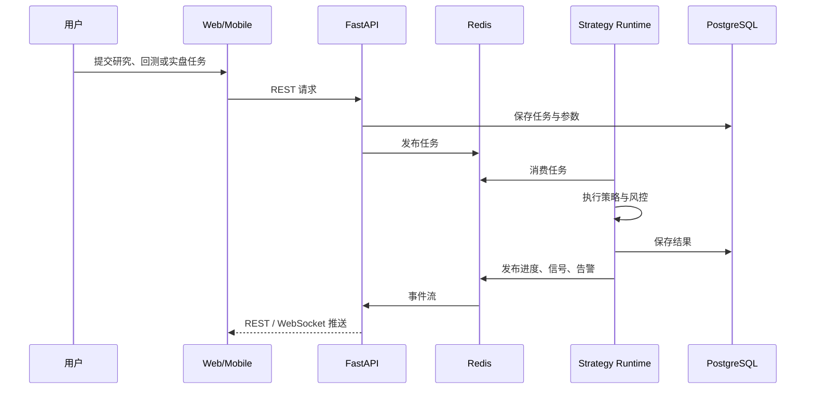

# NextLeek v3

NextLeek v3 是一次独立重建，不复制、不迁移、不兼容 v2 业务代码。当前实现包含实时系统控制台、因子研究定义、策略定义与运行定义工作区；Web 与移动端共享同一套 v3 API。

当前开发模式将工作区内容原子持久化到 `data/v3-workspaces.json`。运行定义的“启用/暂停”只表示配置状态；真正的策略执行必须由独立 runtime 消费任务后回写状态，API 进程不会伪装执行。生产环境仍以 PostgreSQL 作为权威业务存储。

## 架构图



## 运行链路



## 模块边界

| 模块 | 技术 | 职责 |
| --- | --- | --- |
| `backend` | Python 3.11+、FastAPI | 认证、研究、策略、回测、实时任务和查询 API |
| `backend/app/runtime` | 独立 Python 进程 | 隔离执行策略任务；不与 Web 请求进程混跑 |
| `web` | Vue 3、TypeScript、Vite、Pinia | 桌面研究与实时监控工作台 |
| `mobile` | React Native、Expo Router | 自选、策略状态、信号和风险告警 |
| `postgres` | PostgreSQL | 用户、策略版本、任务、结果、持仓和审计数据 |
| `redis` | Redis | 任务队列、运行时心跳、缓存和实时事件 |
| `nginx` | Nginx | 统一入口、静态页面和 API 反向代理 |

## 目录结构

```text
NextLeek/
├── backend/
│   ├── app/
│   │   ├── api/             # REST API
│   │   ├── core/            # 配置与基础设施
│   │   └── runtime/         # 隔离策略运行时
│   └── tests/
├── web/                     # Vue 3 Web
├── mobile/                  # React Native / Expo
├── nginx/                   # 统一网关配置
├── docker-compose.yml
└── .env.example
```

## 核心原则

1. v3 不导入任何 v2 模块，也不保留兼容层。
2. API 进程不直接执行长时间策略；策略在独立 runtime 中运行。
3. PostgreSQL 保存权威业务状态，Redis 只承载短期状态、队列和事件。
4. Web 与移动端共享 API 契约，不共享 UI 实现。
5. 行情源和量化引擎通过适配器接入，业务层不绑定单一供应商。
6. 每个功能必须同时具备权限边界、运行状态、错误状态和审计信息。

## 本地运行

```bash
cp .env.example .env
docker compose up --build
```

启动后：

- Web：`http://localhost:8080`
- 健康检查：`http://localhost:8080/api/health`
- API 文档：`http://localhost:8080/api/docs`

独立开发：

```bash
cd backend && python -m pip install -e '.[dev]' && uvicorn app.main:app --reload
cd web && npm install && npm run dev
cd mobile && npm install && npm run start
```

## 开发顺序

1. 身份认证、用户与权限模型。
2. 行情适配层、标的目录和数据质量检查。
3. 策略版本管理、参数 Schema 和代码安全校验。
4. 回测任务、结果指标、交易明细和参数优化。
5. 隔离实时运行、行情订阅、风控、持仓和订单状态机。
6. WebSocket 实时信号、告警和运行日志。
7. Web 研究工作台与移动端监控页面。
8. 可观测性、审计、备份、CI/CD 和生产部署。
